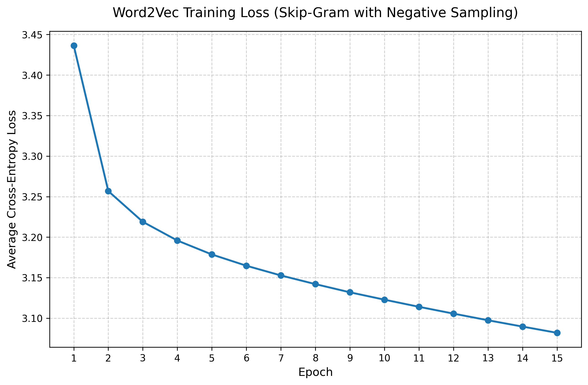
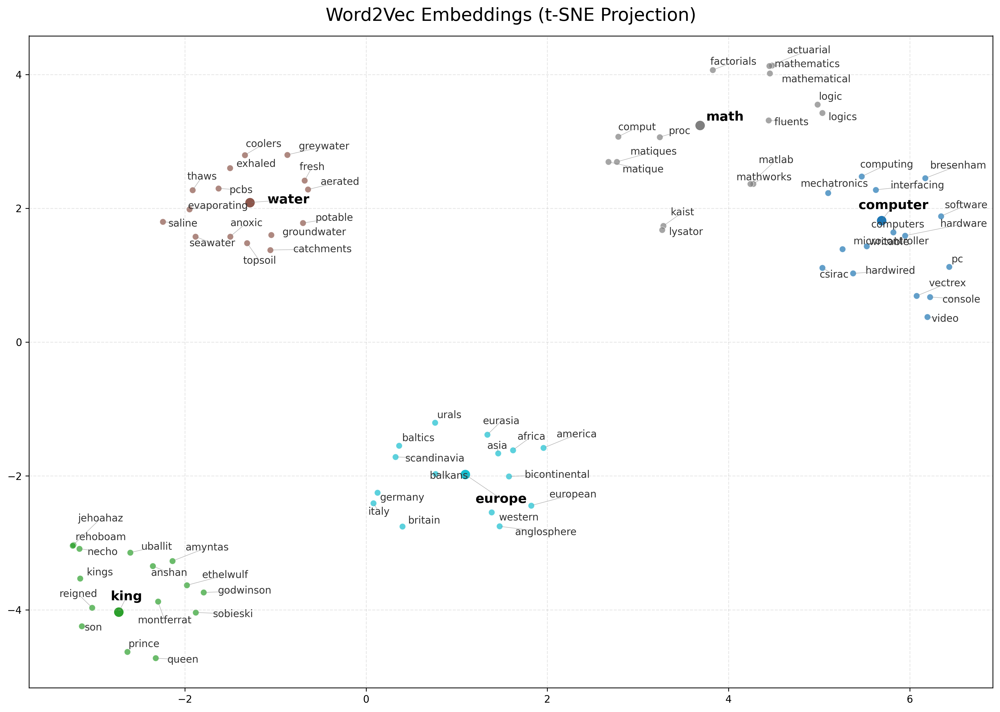

# Pure NumPy Word2Vec (Skip-Gram with Negative Sampling)

A from-scratch, highly optimized implementation of the Word2Vec algorithm (Skip-Gram variant) using **100% pure Python and NumPy**. No PyTorch, TensorFlow, or other deep learning frameworks were used.

This project demonstrates a deep understanding of natural language processing mathematics, matrix calculus, and memory-efficient array manipulation in Python.

## Features

- **Strictly Pure NumPy**: Forward passes, backpropagation, and parameter updates are all derived and calculated using pure NumPy matrix operations.
- **Skip-Gram with Negative Sampling (SGNS)**: Implements the highly efficient negative sampling architecture to approximate the softmax denominator.
- **Vectorized Data Processing**: Context window slicing and subsampling masks are fully vectorized in C-level NumPy, completely avoiding slow Python `for` loops during pair generation.
- **Frequent Word Subsampling**: Implements Mikolov's probabilistic subsampling threshold to balance the learning between rare and highly frequent words.
- **Mathematical Stability**: Includes pre-emptive gradient clipping and numerically stable sigmoid functions to prevent floating-point explosions (NaNs).
- **Semantic Evaluation Suite**: Includes scripts to track the real-time evolution of classic word analogies (e.g., *king - man + woman = queen*) across training epochs, visualize semantic clusters, and benchmark against Google's official test set.

## Training Performance & CPU Utilization

**Training Time:** ~8 hours and 40 minutes (15 Epochs on the 17-million-word `text8` corpus, processing ~600 million word pairs).

If you monitor system resources during training, you will notice that CPU utilization remains relatively low (often pegged to a single core). **This is a known, expected limitation of strict pure-NumPy Word2Vec implementations**. To maintain perfect mathematical correctness without using a compiled C++ extension or Cython:

1. **The Accumulation Bomb:** Frequent words (like "the") appear hundreds of times in a single batch. To prevent race conditions and ensure every gradient update is applied correctly, we must use NumPy's `np.add.at()`. This function forces a strict, sequential, single-threaded C loop.
2. **Batched Matmul Limitations:** While NumPy's underlying BLAS backend (OpenBLAS/MKL) excels at multithreading massive 2D matrix multiplications, it does not automatically multithread the thousands of tiny batched 1D/2D dot products required for negative sampling.

Production libraries (like Gensim) achieve 100% CPU utilization by dropping out of pure Python and using Cython to release the Global Interpreter Lock (GIL) and perform lock-free atomic updates. **This codebase prioritizes pure mathematical correctness and strict adherence to the NumPy constraint over unsafe multithreaded workarounds**.

### Training Loss Curve
With **15 negative samples**, the mathematical floor for cross-entropy loss on this dataset is roughly ```~3.08```. The model successfully converges and stabilizes at this mathematical limit.

<div style="text-align: center;">
  
</div>

## Project Structure

```
├── data/
│   ├── eval/
│   │   └── questions-words.txt            # Google Word Analogy Test Set
│   └── raw/
│       └── text8                          # The text8 corpus (downloaded separately)
├── saved_models/                          # Auto-generated directory for artifacts
│   ├── cluster_plot_t-sne_adjusted.png    # 2D visualization of semantic clusters
│   └── loss_curve.png                     # Plot of the training loss over 15 epochs
├── src/
│   ├── benchmark.py                       # Evaluates model against Google's test set
│   ├── data_loader.py                     # Vectorized pair generation & subsampling
│   ├── evaluate.py                        # Nearest neighbors and analogy testing
│   ├── track_evolution.py                 # Tracks analogy progress across checkpoints
│   ├── visualize.py                       # t-SNE / PCA dimension reduction & plotting
│   └── word2vec.py                        # Core pure-NumPy SGNS model architecture
└── main.py                                # Training loop and dynamic learning rate decay
```

## Installation & Setup

### 1. Clone the repository:
```
git clone https://github.com/Stefcool8/Word2Vec.git
cd Word2Vec
```

### 2. Install dependencies:
While the core training loop requires only ```numpy```, the evaluation and 
visualization scripts require a few standard data science packages.
```
pip install -r requirements.txt
```

### 3. Download the Dataset:
Place the [text8 corpus](http://mattmahoney.net/dc/text8.zip) (or any clean text file) into ```data/raw/text8```.

Place the [Google Analogy Test Set](https://raw.githubusercontent.com/tmikolov/word2vec/master/questions-words.txt) 
into ```data/eval/questions-words.txt```.

## Usage

### 1. Train the Model
Run the main script to start data preparation and training.
```
python main.py
```

### 2. Evaluate Semantic Similarities
Once you have trained the model (or after the first epoch finishes), 
you can test nearest neighbors and analogies.
```
python src/evaluate.py
```

#### *Actual Output* (*obtained after 15 epochs of training*):
```
Analogy Test: king - man + woman = ?
========================================
  queen: 0.6801
  infanta: 0.5958
  yolande: 0.5864
```

### 3. Track Analogy Evolution
Watch how the model learns a specific semantic relationship over time by 
tracking it across all saved epoch checkpoints.
```
python src/track_evolution.py
```

### 4. Visualizing Semantic Clusters
Reduce the 100-dimensional embedding space to 2D using t-SNE to visualize 
topological groupings of semantic concepts.
```
python src/visualize.py
```
The resulting clusters are visually appealing and informative:

<div style="text-align: center;">
  
</div>


### 5. Benchmark Accuracy
Evaluated on the official Google Word Analogy Test Set (```questions-words.txt```). 
Despite the strict pure-NumPy constraints and the small size of the training corpus (**~17M words**), 
the model successfully captures deep semantic relationships, achieving highly competitive baseline accuracy.
```
python src/benchmark.py
```

#### Results (*obtained after 15 epochs of training*):

- **Overall Accuracy**: 33.5% (5,968 / 17,827)
- **Capital-Countries**: 76.7%
- **Nationalities**: 73.4%
- **Family Relationships**: 47.1%

## Core Hyperparameters (<span style="font-size:16px; font-weight:normal;">```main.py```</span>)
- ```EMBEDDING_DIM = 100```
- ```WINDOW_SIZE = 5```
- ```NUM_NEG_SAMPLES = 15```
- ```INITIAL_LEARNING_RATE = 0.025```
- ```BATCH_SIZE = 2048``` (*Can be scaled up depending on RAM*)